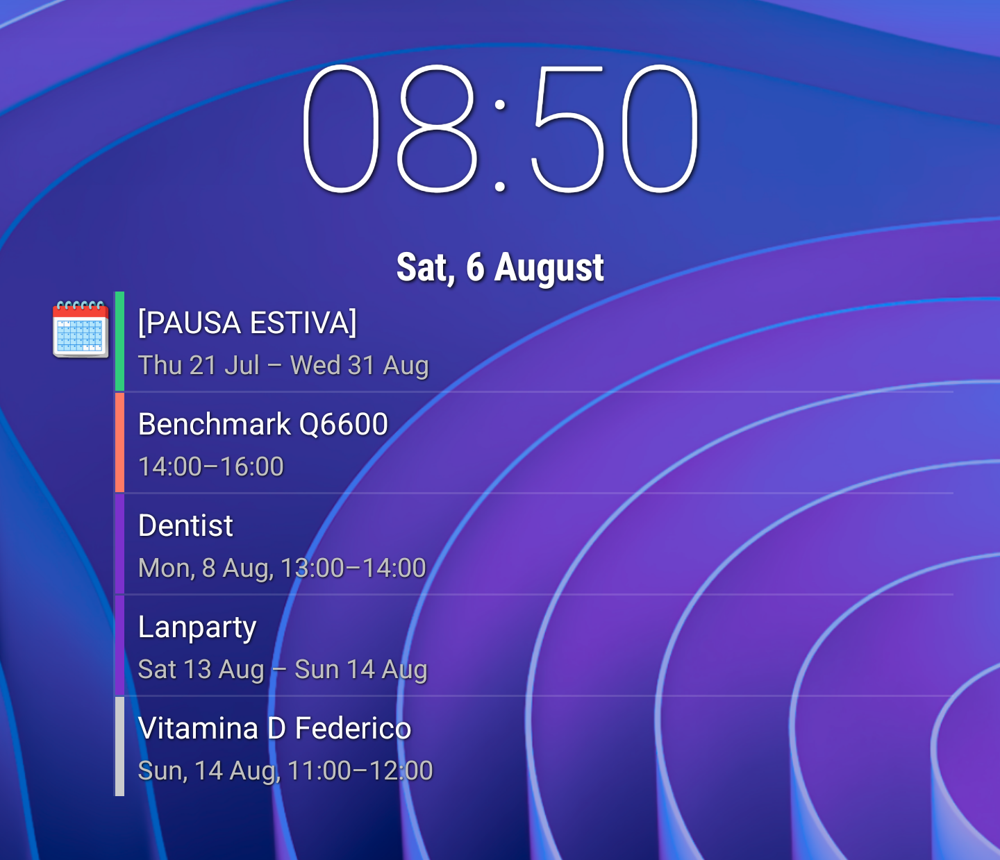

# Clock 31

Clock 31 is a Clock + Calendar combo widget for Android, inspired by (but not forked from) the cLock widget found in old versions of LineageOS.

The widget shows the current time and date, the next alarm (if any), and upcoming events for all your calendars (the colors on the left indicates the calendar to which they belong). Some useful shortcuts are also provided: tapping the clock will bring you to the clock and alarm app, tapping the calendar icon will open the calendar, tapping an event will bring you to the details of that event.

## Download
[Download APK](https://downloads.fdossena.com/geth.php?r=clock31-apk)

## Compatibility
Android 5.0 (SDK 21) or newer

## License
Copyright (C) 2022 Federico Dossena

This program is free software: you can redistribute it and/or modify
it under the terms of the GNU General Public License as published by
the Free Software Foundation, either version 3 of the License, or
(at your option) any later version.

This program is distributed in the hope that it will be useful,
but WITHOUT ANY WARRANTY; without even the implied warranty of
MERCHANTABILITY or FITNESS FOR A PARTICULAR PURPOSE.  See the
GNU General Public License for more details.

You should have received a copy of the GNU General Public License
along with this program.  If not, see <http://www.gnu.org/licenses/>.
